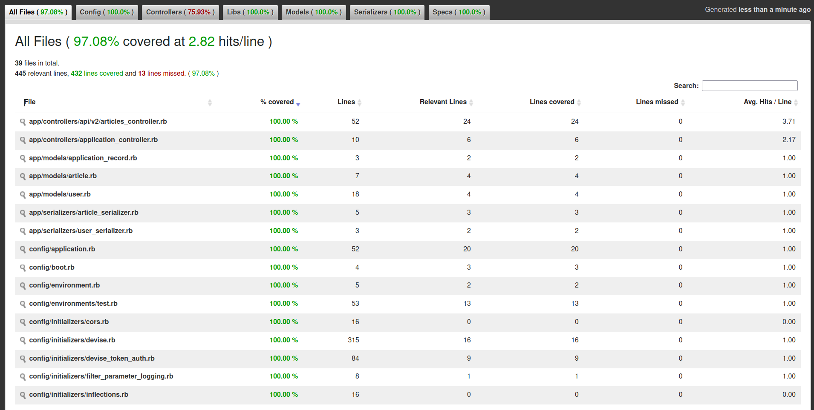

# Blog API

API com Rails 8 e Devise Token Auth, explorando implementação de autenticação para aplicação Web.

## Tecnologias Utilizadas

| Tecnologias | Versão | 
|----------|----------|
| Ruby | 3.2.0 | 
| Rails | 8.0.1 | 
| PostgreSQL | 1.1 |
| Devise Token Auth | 1.2 | 

## Instalação

1. Clone o repositório:
   ```bash
   git clone https://github.com/maurobiazutti/rails-devise-token-auth-learning
   ```
2. Navegue até o diretório do projeto:
   ```bash
   cd blog_api
   ```
3. Instale as dependências:
   ```bash
   bundle install
   ```
4. Configure o banco de dados:
   ```bash
   rails db:create
   rails db:migrate
   ```

## Uso

Para executar a aplicação, use o seguinte comando:

```bash
bin/rails server
```

A aplicação estará disponível em `http://localhost:3000`.

## Testes

Para executar os testes, use o seguinte comando:
``` bash
bundle exec rspec
```



## Contribuição

Sinta-se à vontade para abrir issues ou pull requests.
